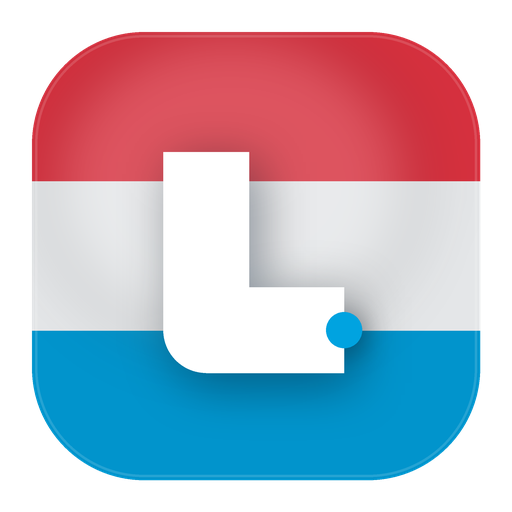

<div align="center">
  
  <h1>LODVault</h1>
  <p><strong>Your personal vocabulary vault for lod.lu</strong></p>
  <p>
    Save Luxembourgish words as you browse, study with flashcards,<br/>
    add notes, and export your list — all without leaving the dictionary.
  </p>
  <p>
    <a href="https://lod.lu">lod.lu</a> ·
    <a href="#install">Install</a> ·
    <a href="#features">Features</a> ·
    <a href="#credits">Credits</a> ·
    <a href="LICENSE">MIT License</a>
  </p>
</div>

---

## What is LODVault?

[LOD — Lëtzebuerger Online Dictionnaire](https://lod.lu) is the official Luxembourgish dictionary. It is well-designed and comprehensive, but it has no way to save words, track vocabulary, or study what you have looked up.

**LODVault** is a browser extension that adds that layer on top of LOD. It lives inside the pages you already use and gives you a personal, local vocabulary vault — no account required, no data leaves your browser.

---

## Features

| | |
|---|---|
| 📌 **Save words** | Favorite or add to Study directly from any LOD article page |
| 📝 **Notes** | Write your own note for each saved word |
| 🔍 **Search** | Filter your saved words in the popup |
| 🃏 **Flashcards** | Review your saved words with a simple flashcard mode |
| 👁 **Preview** | Browse your full word list in a clean page — no download needed |
| 📤 **Export HTML** | Download a standalone, searchable HTML page of your words |
| 📦 **Export / Import JSON** | Back up and restore your vocabulary |
| 🔒 **Local-first** | All data stored in `chrome.storage.local` — nothing leaves your browser |

---

<h2 id="install">Install</h2>

LODVault is not yet on the Chrome Web Store.  
You can load it directly from source in a few steps.

### Requirements
- Google Chrome, Microsoft Edge, or any Chromium-based browser

### Steps

1. [Download or clone this repository](https://github.com/Mohammed-Ashour/lod-vault)

   ```bash
   git clone https://github.com/Mohammed-Ashour/lod-vault.git
   ```

2. Open your browser and go to:

   ```
   chrome://extensions
   ```

3. Enable **Developer mode** (toggle in the top-right corner)

4. Click **Load unpacked**

5. Select the `lod-vault` folder

The **LODVault** icon will appear in your browser toolbar.

---

## How to use

### Save a word
1. Open any word page on LOD, for example:  
   `https://lod.lu/artikel/SOZIALIST1`
2. A **LODVault banner** appears directly under the word title
3. Click **Save to Favorites** or **Add to Study**

### Manage your words
- Click the **LODVault icon** in your browser toolbar to open the popup
- Search, add notes, toggle lists, or delete words from there

### Study with flashcards
- Click **Flashcards** in the popup
- Choose a deck: Study list, Favorites, or All saved
- Click the card or **Reveal** to show the full meaning

### Preview and export
- **Preview** — opens a live, searchable page of your saved words in a new tab
- **HTML** — downloads a standalone HTML file you can keep or share
- **Export JSON** — downloads a full backup of your data
- **Import JSON** — restores or merges a previous backup

---

## Privacy

- LODVault does **not** collect, transmit, or share any data
- Everything you save stays in your browser via `chrome.storage.local`
- No analytics, no tracking, no external requests

---

<h2 id="credits">Credits</h2>

LODVault is built on top of [LOD — Lëtzebuerger Online Dictionnaire](https://lod.lu),  
the official Luxembourgish dictionary maintained by the  
[Zenter fir d'Lëtzebuerger Sprooch](https://portal.education.lu/zls/)  
under the Luxembourg Ministry of Culture.

All dictionary content, word definitions, and translations belong to LOD and their respective rights holders.  
LODVault only adds a personal save layer — it does not reproduce or redistribute any dictionary content.

---

## License

[MIT](LICENSE) © 2025 Mohammed Ashour
