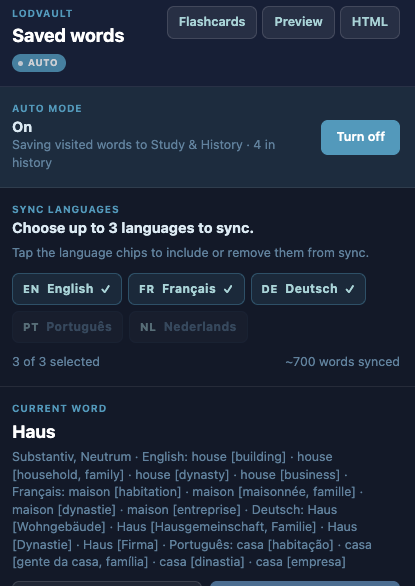
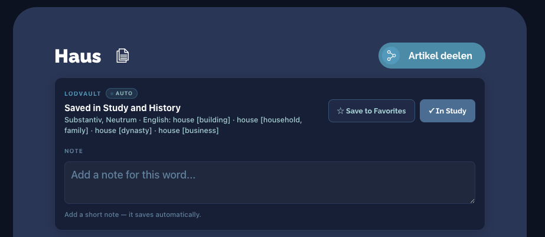
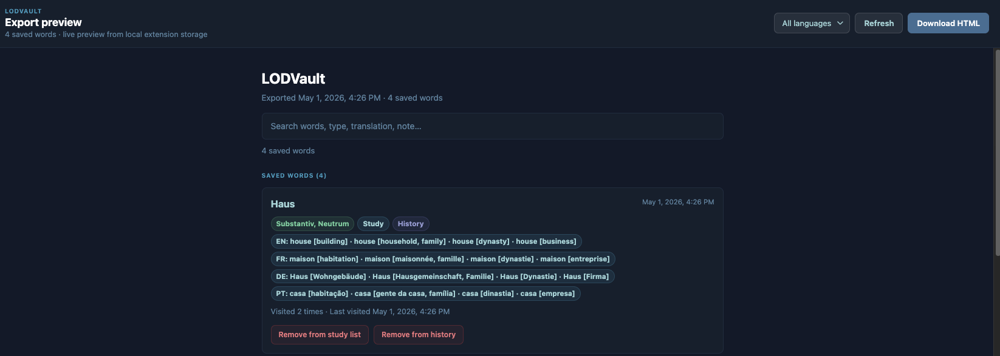

<div align="center">
  
  <h1>LODVault</h1>
  <p><strong>Your personal vocabulary vault for lod.lu</strong></p>
  <p>
    Save Luxembourgish words as you browse, study with flashcards,<br/>
    add notes, and export your list — all without leaving the dictionary.
  </p>
  <p>
    <a href="https://lod.lu">lod.lu</a> ·
    <a href="https://chromewebstore.google.com/detail/gdileleimdnibmieodhnjijmepjdfgil?utm_source=item-share-cb">Chrome Web Store</a> ·
    <a href="#install">Install</a> ·
    <a href="#features">Features</a> ·
    <a href="#credits">Credits</a> ·
    <a href="LICENSE">MIT License</a>
  </p>
</div>

---

### Popup



The popup shows your saved word count, lets you toggle **Auto mode**, pick **sync languages**, and manage the word you are currently reading.

---

### Article banner



A banner is injected directly under the article heading on every `lod.lu/artikel/…` page. Save to Favorites or Study, see the translation summary, and add a personal note — without leaving the dictionary.

---

### Preview page



The preview page lists all your saved words with their translations, POS tags, and list membership. Filter by language, search, or download as a standalone HTML file.

---

## What is LODVault?

[LOD — Lëtzebuerger Online Dictionnaire](https://lod.lu) is the official Luxembourgish dictionary. It is well-designed and comprehensive, but it has no way to save words, track vocabulary, or study what you have looked up.

**LODVault** is a browser extension that adds that layer on top of LOD. It lives inside the pages you already use and gives you a personal, local vocabulary vault — no account required, no external backend, and optional browser sync when you want it.

---

## Features

| | |
|---|---|
| 📌 **Save words** | Favorite or add to Study directly from any LOD article page |
| 🤖 **Auto mode** | Automatically record every visited LOD article into Study and History |
| 📝 **Notes** | Write your own note for each saved word |
| 🔍 **Search** | Filter your saved words in the popup |
| 🃏 **Flashcards** | Review your saved words with a simple flashcard mode |
| 👁 **Preview** | Browse your full word list in a clean page — no download needed |
| 📤 **Export HTML** | Download a standalone, searchable HTML page of your words |
| 📦 **Export / Import JSON** | Back up and restore your vocabulary |
| ☁️ **Optional browser sync** | Sync a compact copy across Chrome profiles with configurable language selection |
| 🔒 **Local-first** | `chrome.storage.local` stays authoritative; sync is only a compact replica |

---

<h2 id="install">Install</h2>

LODVault is available on the Chrome Web Store:

- **Chrome Web Store:** https://chromewebstore.google.com/detail/gdileleimdnibmieodhnjijmepjdfgil?utm_source=item-share-cb

If you prefer, you can still load it directly from source.

### Requirements
- Google Chrome, Microsoft Edge, or any Chromium-based browser

### Install from the Chrome Web Store

1. Open the store listing:
   https://chromewebstore.google.com/detail/gdileleimdnibmieodhnjijmepjdfgil?utm_source=item-share-cb
2. Click **Add to Chrome**
3. Confirm the installation

### Install from source

1. [Download or clone this repository](https://github.com/Mohammed-Ashour/lod-vault)

   ```bash
   git clone https://github.com/Mohammed-Ashour/lod-vault.git
   ```

2. Open your browser and go to:

   ```
   chrome://extensions
   ```

3. Enable **Developer mode** (toggle in the top-right corner)

4. Click **Load unpacked**

5. Select the `lod-vault` folder

The **LODVault** icon will appear in your browser toolbar.

---

## How to use

### Save a word
1. Open any word page on LOD, for example:  
   `https://lod.lu/artikel/SOZIALIST1`
2. A **LODVault banner** appears directly under the word title
3. Click **Save to Favorites** or **Add to Study**

### Manage your words
- Click the **LODVault icon** in your browser toolbar to open the popup
- Turn **Auto mode** on if you want every visited LOD article to be added to **Study** and **History** automatically
- Choose up to **3 sync languages** in the popup if you want a smaller synced copy across browsers
- Search, add notes, toggle lists, or delete words from there

### Study with flashcards
- Click **Flashcards** in the popup
- Choose a deck: Study list, Favorites, or All saved
- Click the card or **Reveal** to show the full meaning

### Preview and export
- **Preview** — opens a live, searchable page of your saved words in a new tab
- **HTML** — downloads a standalone HTML file you can keep or share
- **Export JSON** — downloads a full backup of your saved words and extension settings
- **Import JSON** — restores or merges a previous backup, including supported settings

---

## Testing

LODVault includes a small automated test suite to keep the core behavior stable.

### Run the tests

```bash
npm install
npm test
```

### What is covered
- shared storage and migration logic
- save / remove / note flows
- JSON import / export behavior
- export HTML generation
- popup rendering, sync language selection, default recent list behavior, and search filtering
- flashcard deck refresh behavior when extension storage changes
- background mutation queue behavior, sync bridging, and LOD tab reloads on install
- content-script extraction from LOD article pages
- injected banner rendering, messaging, and saved-entry enrichment
- compact sync serialization, merge behavior, sharding, and quota fallback logic

---

## Privacy

- LODVault does **not** collect, transmit, or share data with any external service
- Everything you save lives in your browser via `chrome.storage.local`
- If browser sync is enabled, a compact replica is stored in `chrome.storage.sync`
- No analytics, no tracking, no external requests

---

<h2 id="credits">Credits</h2>

LODVault is built on top of [LOD — Lëtzebuerger Online Dictionnaire](https://lod.lu),  
the official Luxembourgish dictionary maintained by the  
[Zenter fir d'Lëtzebuerger Sprooch](https://portal.education.lu/zls/)  
under the Luxembourg Ministry of Culture.

All dictionary content, word definitions, and translations belong to LOD and their respective rights holders.  
LODVault only adds a personal save layer — it does not reproduce or redistribute any dictionary content.

---

## License

[MIT](LICENSE) © 2025 Mohammed Ashour
