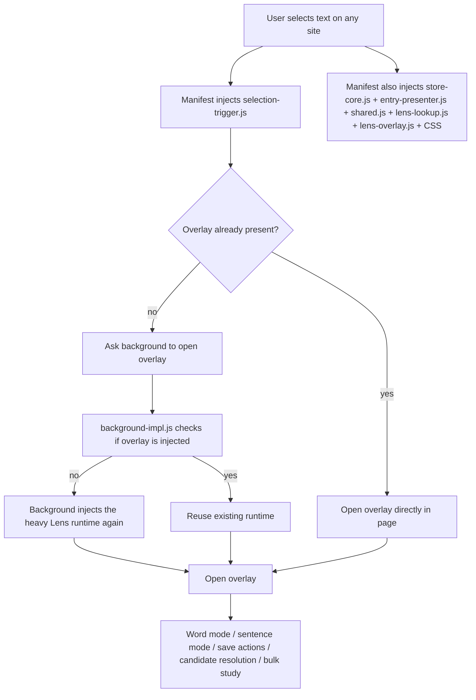
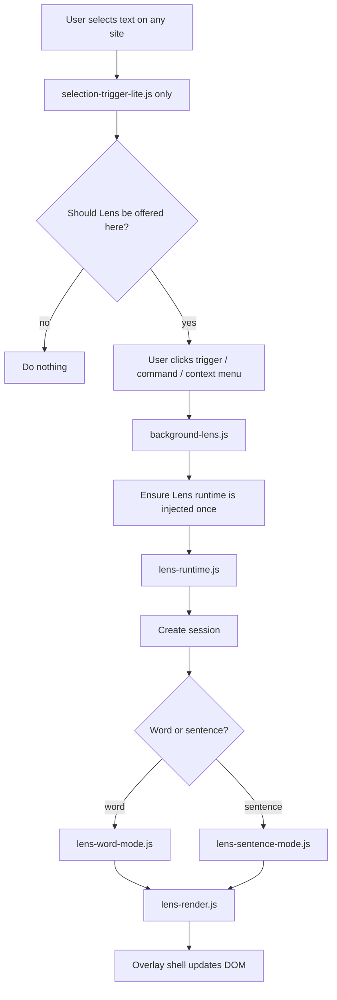
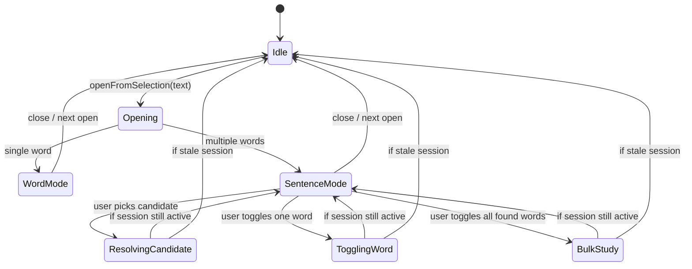
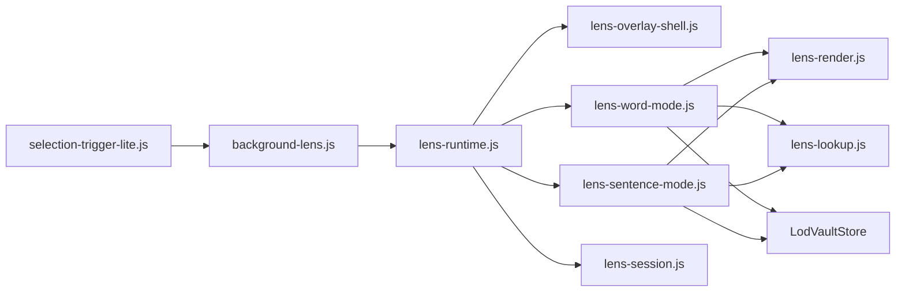

# LOD Lens Architecture Review

A structural review of the `feature/lod-lens-selection-lookup` branch, focused on code quality, long-term maintainability, and simplification opportunities.

## Executive summary

The branch adds real product value, but the implementation currently bakes in too much architectural weight for the feature surface.

The main theme is this:

> The branch solves the problem, but it does so with too many moving pieces loaded in too many places.

The cleanest path forward is to **simplify ownership boundaries**:

1. Keep only a **tiny trigger script** on arbitrary websites.
2. Let the **background worker own injection** of the heavy lookup/overlay runtime.
3. Give sentence mode a **session controller** so async updates cannot repaint stale UI.
4. Split the overlay into smaller modules instead of letting one large file absorb every concern.
5. Stop normalizing a **checked-in generated background bundle** as a source artifact.

---

## High-conviction findings

### 1. Two injection architectures exist at the same time

Today the branch does both:

- injects the full Lens runtime on all pages via `manifest.json`
- keeps background-driven on-demand injection in `scripts/background-impl.js`

That creates duplicated responsibility:

- `manifest.json` injects `store-core.js`, `entry-presenter.js`, `shared.js`, `lens-lookup.js`, `lens-overlay.js`, and `styles/lens-overlay.css` on every `http://*/*` and `https://*/*` page.
- `scripts/background-impl.js` still checks whether the overlay is present and injects the same runtime on demand.
- `scripts/selection-trigger.js` is already written to fall back to the background path if the overlay is not present.

This means the codebase currently supports two different answers to the same question:

> How does the Lens runtime arrive on a page?

That should have a single answer.

### Recommendation

Keep the lightweight trigger globally injected, and move the heavy Lens runtime to **background-owned on-demand injection**.

That is the clean code-judo move because it deletes complexity instead of redistributing it.

---

### 2. Sentence mode has async state, but not a real session boundary

The main open flow uses `requestId` guards, which is good.

But several sentence-mode actions still operate on mutable shared state after `await` points:

- candidate resolution
- per-word save toggles
- bulk study toggles
- saved-state synchronization

That means a user can:

1. start a sentence lookup
2. trigger another lookup or close/reopen the overlay
3. let an older async task finish later
4. have the old task mutate or repaint newer UI state

This is a boundary problem, not just a local bug risk.

### Recommendation

Introduce a **Lens session controller**:

- every overlay open creates a session object with an id/token
- all async work is scoped to that session
- renderers only render the active session
- async completions bail out if the session is stale

That gives sentence mode a real ownership model instead of a shared mutable global model.

---

### 3. `scripts/lens-overlay.js` is absorbing too many responsibilities

The file is currently doing all of the following:

- root creation
- event delegation
- positioning
- word mode
- sentence mode
- candidate selection
- suggestion handling
- save toggles
- bulk study orchestration
- accordion state
- status messaging
- request invalidation

That makes the file feel like a UI shell, a controller, a state store, and an orchestration layer all at once.

### Recommendation

Split it into focused modules:

- `lens-overlay-shell.js` — root, open/close, panel positioning
- `lens-word-mode.js` — single-word lookup flow
- `lens-sentence-mode.js` — sentence lookup flow and sentence-level actions
- `lens-render.js` or `lens-templates.js` — markup generation only
- `lens-session.js` — active session lifecycle + stale async guards

Even if the exact filenames differ, the decomposition should follow the ownership boundaries above.

---

### 4. The checked-in generated background bundle is bad repo hygiene

The branch checks in `scripts/background-bundle.js`, which is generated and very large.

That has several downsides:

- noisy diffs
- harder review surface
- giant generated artifact treated like hand-maintained source
- test coverage now starts to defend the existence of the artifact itself

### Recommendation

Treat the bundle as a build artifact:

- generate it in build/release flows
- avoid reviewing or maintaining it as authored code
- keep tests pointed at source behavior, not artifact presence, unless packaging requires a narrow smoke test

If packaging truly requires a committed artifact, keep that as an explicit exception rather than letting the repo quietly normalize it.

---

## Current architecture



## Why the current architecture feels heavy

The issue is not just that there are many files.

The issue is that the architecture currently mixes:

- **global eager injection**
- **background lazy injection**
- **UI state management**
- **lookup orchestration**
- **store mutation orchestration**

into overlapping layers.

That leads to duplicated responsibility and makes future changes more likely to add one more branch instead of improving the model.

---

## Proposed target architecture



## What changes with this design

### On arbitrary sites
Only the following should be present by default:

- page heuristics
- selection tracking
- floating trigger button
- a message to the background when the user asks to open Lens

That keeps the page footprint small and keeps the ownership boundary obvious.

### In the background
The background becomes the canonical owner of:

- commands
- context menu
- runtime injection
- proxying approved LOD API requests if needed

### In the Lens runtime
The injected runtime becomes responsible for:

- rendering the overlay
- running lookups
- coordinating save actions
- managing an active session

That is a much cleaner separation than having the manifest and background both partly own runtime injection.

---

## Proposed sentence-mode session model



## Session controller contract

A small session model can make the implementation much more direct:

```text
LensSession
- id
- query
- mode: "word" | "sentence"
- closed
- data
- isActive()
- guard(fnResult)
```

Rules:

1. every `openFromSelection()` creates a new session
2. async actions capture the current session id
3. after each await, actions check whether the session is still active
4. render functions accept explicit session data instead of reading ambient mutable state

This removes a whole class of stale repaint bugs.

---

## Suggested module boundaries



## Suggested responsibilities

### `selection-trigger-lite.js`
- selection normalization
- Luxembourgish heuristics
- trigger placement
- background message dispatch

### `background-lens.js`
- commands and context menu
- ensuring runtime injection
- approved fetch proxy
- single entry point for opening Lens on a tab

### `lens-runtime.js`
- bootstraps overlay shell and session lifecycle
- routes into word mode or sentence mode

### `lens-word-mode.js`
- single-word lookup path
- candidate list path
- suggestion path
- save state sync for one entry

### `lens-sentence-mode.js`
- tokenized sentence lookup
- per-word actions
- bulk actions
- candidate resolution for sentence words

### `lens-render.js`
- pure markup or DOM patch helpers
- no store I/O
- no fetches
- no global state decisions

### `lens-session.js`
- active session id/token
- stale async invalidation
- convenience guards for async callbacks

---

## Source of truth cleanup

### Current source-of-truth problem
The feature currently spreads authority across:

- `manifest.json`
- `background-impl.js`
- `selection-trigger.js`
- `lens-overlay.js`

The architecture is easier to evolve when each concern has a single owner.

### Proposed ownership table

| Concern | Canonical owner |
|---|---|
| Is Lens available on this page? | `selection-trigger-lite.js` |
| How does the heavy runtime get onto the page? | `background-lens.js` |
| What is the active lookup session? | `lens-session.js` |
| How is sentence mode orchestrated? | `lens-sentence-mode.js` |
| How is UI rendered? | `lens-render.js` / shell |
| How are entries persisted? | `LodVaultStore` |

---

## Suggested migration plan

### Phase 1 — simplify injection first
- Remove heavy Lens scripts from the all-sites content script manifest block.
- Keep only the selection trigger globally injected.
- Let the background inject the Lens runtime on demand.

This is the highest-leverage simplification.

### Phase 2 — introduce a session boundary
- Create a small session helper.
- Convert sentence-mode async actions to use it.
- Stop sentence actions from reading and writing cross-session state after awaits.

### Phase 3 — split the overlay file
- Extract sentence mode first.
- Extract render helpers next.
- Leave the overlay shell as a thin coordinator.

### Phase 4 — clean up bundle ownership
- Stop treating `background-bundle.js` as authored source.
- Keep build/release generation explicit.
- Adjust tests to validate source behavior and packaging separately.

---

## A simpler end-state

The ideal end-state is boring in a good way:

- every page gets a small trigger script
- the background owns injection
- the runtime owns UI
- a session object owns async lifecycle
- renderers are dumb
- store logic stays in the store

That version of the feature will be easier to extend, easier to test, and much harder to accidentally turn into spaghetti.

---

## Appendix: why this is a code-judo move

This is not a recommendation to add more abstraction for its own sake.

It is a recommendation to **delete overlap**:

- one injection model instead of two
- one active session model instead of ambient mutable state
- one overlay shell instead of one giant everything-file
- one build artifact story instead of a half-source half-generated story

That is the shortest path to making the feature feel inevitable instead of merely functional.
